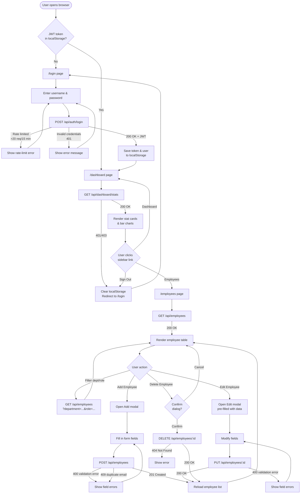
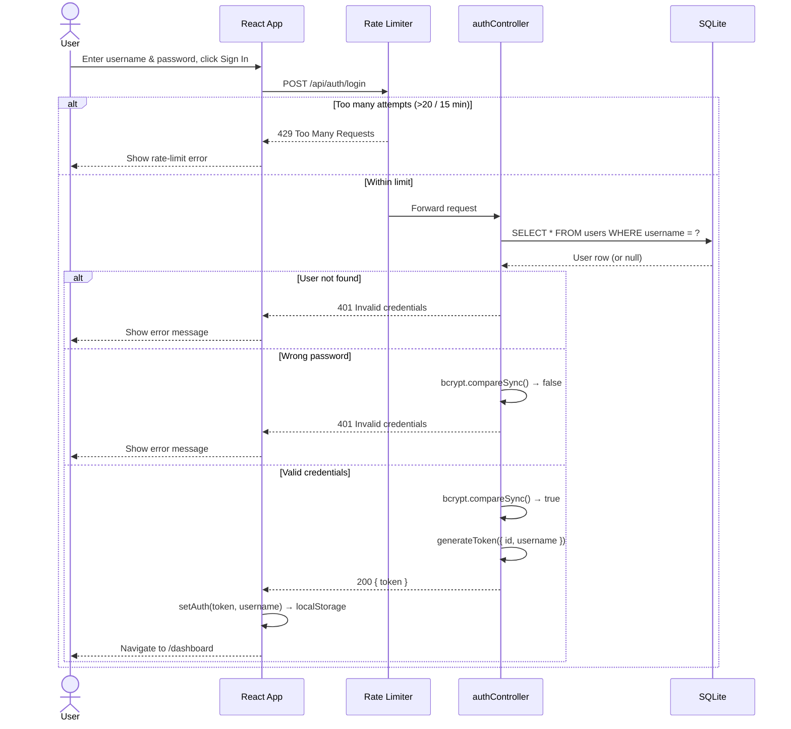
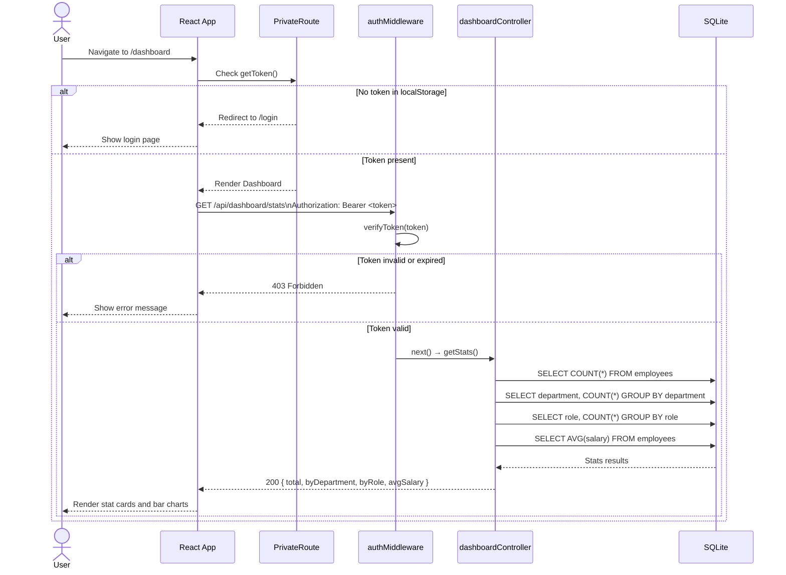
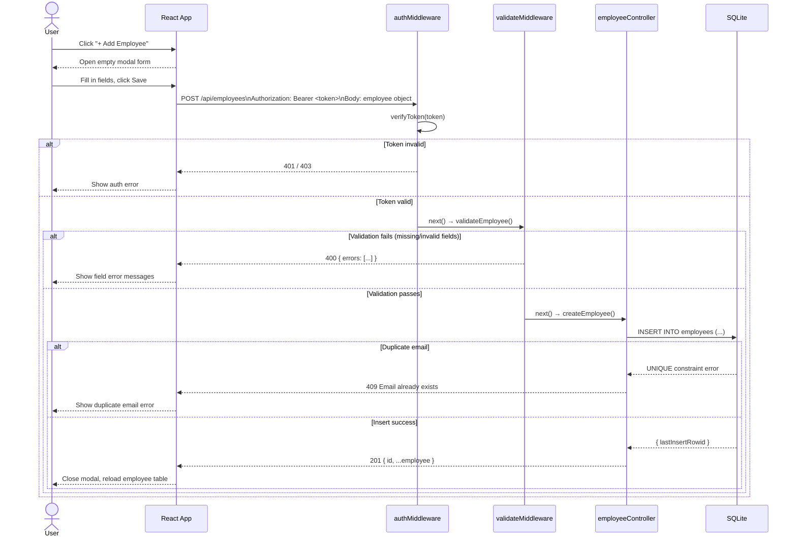
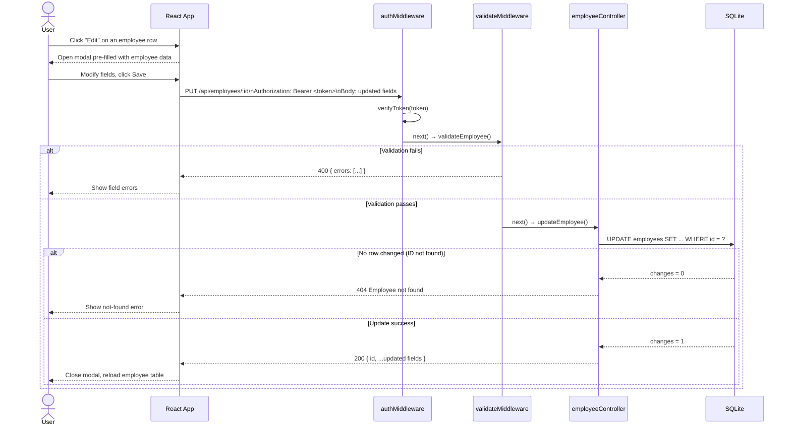
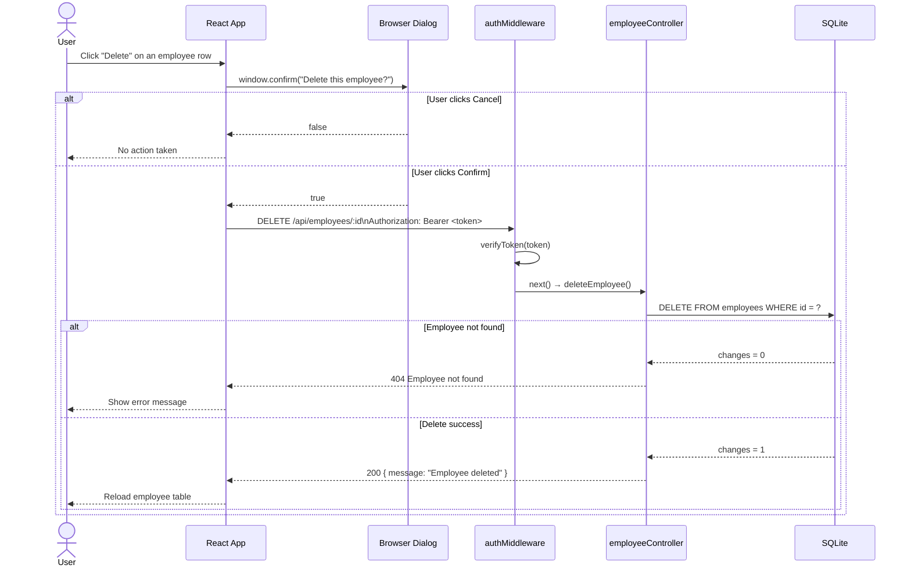
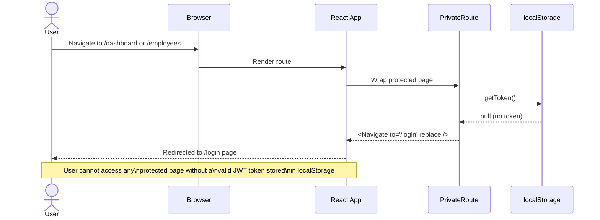

# Employee Management System — Application Documentation

> **Last updated:** 13 March 2026
> **Version:** 1.0.0

---

## Table of Contents

1. [Overview](#overview)
2. [Architecture Summary](#architecture-summary)
3. [User Flow](#user-flow)
4. [Page & Feature Reference](#page--feature-reference)
5. [API Reference](#api-reference)
6. [Sequence Diagrams](#sequence-diagrams)
   - [Login](#1-login-flow)
   - [View Dashboard](#2-view-dashboard)
   - [Create Employee](#3-create-employee)
   - [Edit Employee](#4-edit-employee)
   - [Delete Employee](#5-delete-employee)
   - [Route Guard (unauthenticated access)](#6-route-guard--unauthenticated-access)
7. [Data Model](#data-model)
8. [Security Model](#security-model)

---

## Overview

The **Employee Management System (EMS)** is a full-stack web application for managing employees in an organisation. It provides:

- **Secure login** via JWT authentication
- **Dashboard** with live workforce statistics and charts
- **Employee CRUD** — create, read, update, and delete employees with field validation
- **Filtering** by department and role
- **Responsive UI** built with React

| Layer | Technology |
|---|---|
| Frontend | React 18 + Vite 4 (`localhost:5173`) |
| Backend | Node.js + Express.js (`localhost:3000`) |
| Database | SQLite via `better-sqlite3` |
| Auth | JWT (`jsonwebtoken`) + `bcryptjs` |
| Security | `helmet`, `cors`, `express-rate-limit` |
| Logging | `morgan` |

---

## Architecture Summary

```
┌──────────────────────────────────────┐
│         Browser (React SPA)          │
│  /login  /dashboard  /employees      │
│  PrivateRoute guards protected pages │
└────────────────┬─────────────────────┘
                 │ HTTP (Vite proxy → :3000 in dev)
                 │ (Express serves dist/ directly in prod)
                 ▼
┌──────────────────────────────────────┐
│         Express.js API (:3000)       │
│                                      │
│  helmet → cors → morgan → rateLimit  │
│                                      │
│  POST /api/auth/login                │
│  POST /api/auth/logout               │
│  GET  /api/dashboard/stats  [JWT]    │
│  GET/POST/PUT/DELETE /api/employees  │
│                          [JWT + val] │
│                                      │
│  authMiddleware → validateMiddleware │
│  errorHandler (centralised)          │
│  express.static(frontend-react/dist) │
└────────────────┬─────────────────────┘
                 │
                 ▼
┌──────────────────────────────────────┐
│       SQLite (database.sqlite)       │
│  tables: employees, users            │
└──────────────────────────────────────┘
```

---

## User Flow

The diagram below shows every path a user can take through the application.



---

## Page & Feature Reference

### `/login`
- **Purpose:** Authenticate the user
- **Access:** Public (redirects to `/dashboard` if already logged in)
- **Actions:**
  - Submit username + password → `POST /api/auth/login`
  - On success: stores JWT token and username in `localStorage`, navigates to `/dashboard`
  - On failure: displays an inline error message
- **Rate limit:** Max 20 login attempts per 15-minute window

### `/dashboard`
- **Purpose:** Workforce overview
- **Access:** Protected — requires valid JWT (`PrivateRoute` redirects to `/login` if no token)
- **Data:** `GET /api/dashboard/stats`
- **Displays:**
  - Total employee count
  - Average salary
  - Number of unique departments
  - Number of unique roles
  - Animated bar chart: employees by department
  - Animated bar chart: employees by role

### `/employees`
- **Purpose:** Full CRUD management of employee records
- **Access:** Protected
- **Features:**
  - Filter table by department and/or role
  - **Add Employee** — opens modal → `POST /api/employees`
  - **Edit Employee** — opens pre-filled modal → `PUT /api/employees/:id`
  - **Delete Employee** — confirmation dialog → `DELETE /api/employees/:id`
- **Validation (enforced by server):** name, valid email, department, role, valid date, salary ≥ 0

---

## API Reference

All protected endpoints require the header:
```
Authorization: Bearer <jwt_token>
```

| Method | Endpoint | Auth | Body | Description |
|---|---|---|---|---|
| `POST` | `/api/auth/login` | ❌ | `{ username, password }` | Returns JWT token |
| `POST` | `/api/auth/logout` | ❌ | — | Stateless logout confirmation |
| `GET` | `/api/dashboard/stats` | ✅ | — | Total, avg salary, by dept, by role |
| `GET` | `/api/employees` | ✅ | — | List all employees (supports `?department=` `?role=`) |
| `GET` | `/api/employees/:id` | ✅ | — | Get single employee |
| `POST` | `/api/employees` | ✅ | Employee object | Create employee → `201` |
| `PUT` | `/api/employees/:id` | ✅ | Employee object | Update employee → `200` |
| `DELETE` | `/api/employees/:id` | ✅ | — | Delete employee → `200` |

**Employee object fields:**

| Field | Type | Rules |
|---|---|---|
| `name` | string | Required, non-empty |
| `email` | string | Required, valid email format, unique |
| `department` | string | Required, non-empty |
| `role` | string | Required, non-empty |
| `hireDate` | string | Required, valid ISO date (`YYYY-MM-DD`) |
| `salary` | number | Required, ≥ 0 |

---

## Sequence Diagrams

### 1. Login Flow



---

### 2. View Dashboard



---

### 3. Create Employee



---

### 4. Edit Employee



---

### 5. Delete Employee



---

### 6. Route Guard — Unauthenticated Access



---

## Data Model

### `employees` table

| Column | Type | Constraints |
|---|---|---|
| `id` | INTEGER | PRIMARY KEY AUTOINCREMENT |
| `name` | TEXT | NOT NULL |
| `email` | TEXT | UNIQUE, NOT NULL |
| `department` | TEXT | NOT NULL |
| `role` | TEXT | NOT NULL |
| `hireDate` | TEXT | NOT NULL (ISO format) |
| `salary` | REAL | NOT NULL |

### `users` table

| Column | Type | Constraints |
|---|---|---|
| `id` | INTEGER | PRIMARY KEY AUTOINCREMENT |
| `username` | TEXT | UNIQUE, NOT NULL |
| `password` | TEXT | NOT NULL (bcrypt hash) |

> Default seeded user: `admin` / `admin123`

---

## Security Model

| Concern | Mechanism |
|---|---|
| **Authentication** | JWT signed with `JWT_SECRET` (8h expiry) |
| **Password storage** | bcrypt hash (salt rounds: 10) |
| **HTTP headers** | `helmet` sets Content-Security-Policy, X-Frame-Options, etc. |
| **CORS** | Restricted to `ALLOWED_ORIGIN` (default: `http://localhost:5173`) |
| **Brute force** | `express-rate-limit`: 20 login attempts per 15 minutes |
| **Input validation** | `validateMiddleware` validates all 6 employee fields server-side |
| **Route protection** | `authMiddleware` verifies JWT on every protected endpoint |
| **Client guard** | `PrivateRoute` component redirects unauthenticated users to `/login` |
| **Secrets** | `.env` file (never committed); `.env.example` provided as template |
